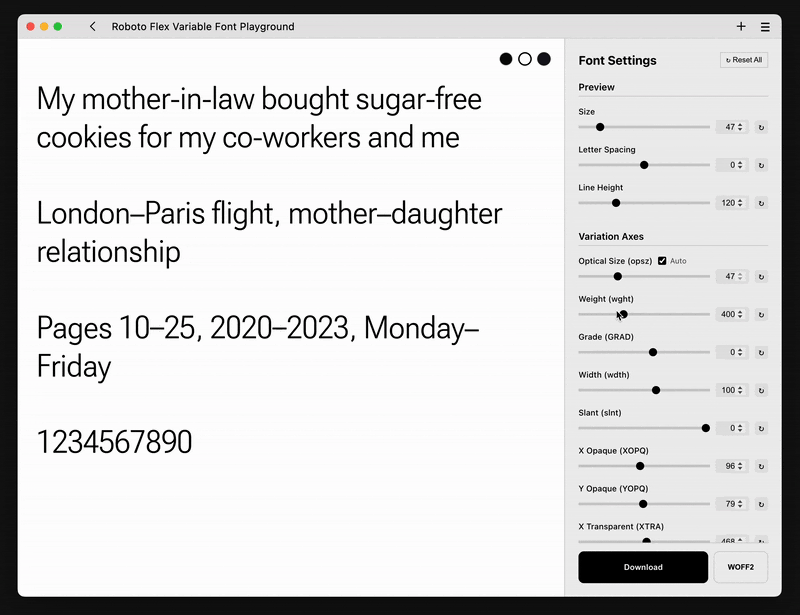

# Roboto Flex Variable Font Playground

Interactive web application for creating static font instances from the Roboto Flex variable font file. Adjust 13 variation axes in real-time, then download your custom .ttf and .woff2 files.



Warning:\
Starting from Dec 9, 2025, I’m using a modified font file in which I added automatic height adjustment for characters like `-, –, +`, bringing them to the same level as lowercase letters. As far as I can tell, nothing broke, but if you notice anything strange, please message me on [Telegram](https://t.me/sugrarin).
.


## Features

✨ **Real-time Preview** - See font changes instantly as you adjust sliders;\
🎨 **13 Variation Axes** - Full control over optical size, weight, width, slant, and more;\
⬇️ **Download Static Fonts** - Generate and download custom .ttf and .woff2 files.

## Quick Start

### 1. Install Dependencies

```bash
pip3 install -r requirements.txt
```

### 2. Start the Server

```bash
python3 server.py
```

The server will start on `http://localhost:5000`

### 3. Open in Browser

```bash
open index.html
```

Or navigate to: `../flex-playground/index.html`

## Variation Axes

| Axis | Range | Description |
|------|-------|-------------|
| **opsz** | 8 - 144 | Optical Size |
| **wght** | 100 - 1000 | Weight |
| **GRAD** | -200 - 150 | Grade |
| **wdth** | 25 - 151 | Width |
| **slnt** | -10 - 0 | Slant |
| **XOPQ** | 27 - 175 | X Opaque |
| **YOPQ** | 25 - 135 | Y Opaque |
| **XTRA** | 323 - 603 | X Transparent |
| **YTUC** | 528 - 760 | Y Transparent Uppercase |
| **YTLC** | 416 - 570 | Y Transparent Lowercase |
| **YTAS** | 649 - 854 | Y Transparent Ascender |
| **YTDE** | -305 - -98 | Y Transparent Descender |
| **YTFI** | 560 - 788 | Y Transparent Figure |

## OpenType Features

(Not sure everything is working, it needs to be checked.)

- **liga** - Standard Ligatures
- **locl** - Localized Forms
- **pnum** - Proportional Numbers
- **rvrn** - Required Variation Alternates

## Files

- `index.html` - Main application interface
- `style.css` - Premium dark mode styling
- `app.js` - Real-time interaction logic
- `server.py` - Flask backend for font generation
- `requirements.txt` - Python dependencies
- `Roboto-Flex-Variable.ttf` - Variable font file

## Technology Stack

- **Frontend**: HTML5, CSS3, Vanilla JavaScript
- **Backend**: Python Flask with CORS support
- **Font Processing**: fontTools library

## How It Works

1. **Real-time Preview**: CSS `font-variation-settings` updates as you adjust sliders
2. **Font Generation**: Python backend uses `fontTools.varLib.instancer` to create static instances
3. **Download**: Generated .ttf/.woff2 file sent to browser via Flask endpoint

## License

Built for font design and typography exploration.

Based on https://github.com/googlefonts/roboto-flex
